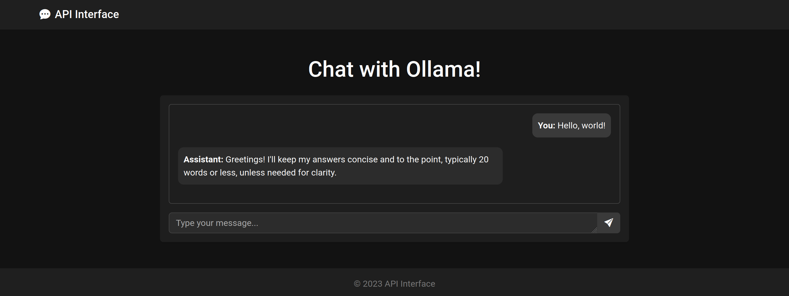

# Llama3.1:8b Local LLM Web Interface

This project provides a simple web interface to interact with the Llama3.1:8b Large Language Model (LLM) running locally on your machine, accessible remotely via a front-end hosted on a DigitalOcean droplet. The setup allows you to experiment with running LLMs locally and provides a user-friendly interface for querying the model.

## Table of Contents

- [Overview](#overview)
- [Prerequisites](#prerequisites)
- [Setup Instructions](#setup-instructions)
  - [1. Set Up the Local LLM Server](#1-set-up-the-local-llm-server)
  - [2. Configure Port Forwarding](#2-configure-port-forwarding)
  - [3. Deploy the Front-End on DigitalOcean](#3-deploy-the-front-end-on-digitalocean)
  - [4. Configure Nginx Reverse Proxy](#4-configure-nginx-reverse-proxy)
- [Usage](#usage)
- [Notes](#notes)
- [License](#license)

## Overview

The project consists of:

- **Local LLM Server**: Running the Llama3.1:8b model using the Ollama web server on your laptop.
- **Front-End**: A simple HTML and JavaScript interface hosted on a DigitalOcean droplet.
- **Nginx**: Nginx configured to serve the front-end and proxy API requests to your local LLM server.

Users can access the web interface hosted on the droplet, submit queries, and receive responses from the LLM running on your laptop.



## Prerequisites

- **Local Machine**:
  - A machine capable of running the Llama3.1:8b model.
  - [Ollama](https://ollama.ai/) installed to serve the LLM.
  - Access to your router for port forwarding configuration.

- **Remote Server**:
  - A DigitalOcean droplet running Ubuntu.
  - Nginx installed.

- **General**:
  - Basic knowledge of command-line operations.
  - Domain name or static IP address (optional but recommended).

## Setup Instructions

### 1. Set Up the Local LLM Server

**Install Ollama and Llama3.1:8b Model**:

1. Install Ollama on your local machine by following the instructions at [ollama.ai](https://ollama.ai/).
2. Download and set up the Llama3.1:8b model within Ollama.

**Run the Ollama Web Server**:

Start the Ollama server to serve the Llama3.1:8b model:

```bash
ollama serve --model llama3.1:8b
```

Ensure the server is listening on a specific port (default is `11434`).

### 2. Configure Port Forwarding

To allow the remote server to communicate with your local LLM server:

1. Access your router's admin panel.
2. Set up port forwarding to forward incoming requests on the selected port to your local machine's IP address.

**Note**: Be cautious with port forwarding; ensure your firewall and security settings are appropriately configured.

### 3. Deploy the Front-End on DigitalOcean

**Set Up the Droplet**:

1. Create a new Ubuntu droplet on DigitalOcean.
2. Update and upgrade packages:

   ```bash
   sudo apt update && sudo apt upgrade -y
   ```

**Install Nginx**:

```bash
sudo apt install nginx -y
```

**Deploy Front-End Files**:

1. Copy the front-end files (`index.html`, `script.js`, etc.) to the droplet.
2. Place them in the web root directory, e.g., `/var/www/llm-frontend`.

### 4. Configure Nginx Reverse Proxy

**Edit Nginx Configuration**:

1. Open the Nginx server block configuration file:

   ```bash
   sudo nano /etc/nginx/sites-available/default
   ```

2. Replace the contents with the provided Nginx configuration, adjusting placeholders:

   - Replace `<>` in `server_name` with your domain or droplet's IP address.
   - Replace `<ip>:<port>` in `proxy_pass` with your public IP and the port forwarded to your local machine.

**Example**:

```nginx
server {
    listen 80;
    server_name your_domain_or_ip;

    root /var/www/llm-frontend;
    index index.html;

    location / {
        try_files $uri $uri/ =404;
    }

    location /api/generate {
        proxy_pass http://your_public_ip:port;
        proxy_set_header Host $host;
        proxy_set_header X-Real-IP $remote_addr;

        # Enable CORS
        add_header 'Access-Control-Allow-Origin' '*' always;
        add_header 'Access-Control-Allow-Methods' 'GET, POST, OPTIONS' always;
        add_header 'Access-Control-Allow-Headers' 'Authorization,Content-Type' always;
        add_header 'Access-Control-Max-Age' 3600 always;

        # Handle preflight OPTIONS requests
        if ($request_method = OPTIONS ) {
            return 204;
        }
    }
}
```

**Test and Restart Nginx**:

```bash
sudo nginx -t
sudo systemctl restart nginx
```

## Usage

1. Navigate to your droplet's IP address or domain in a web browser.
2. The web interface allows you to enter a query and submit it.
3. The query is sent to your local LLM server, and the response is displayed on the page.

**Note**: The JavaScript code modifies the user's prompt to include "only ever Answer in 20 words or less - where reasonably possible" to limit the response length.

## Notes

- Ensure that your local machine is running and connected to the internet whenever you want the web interface to function.
- Be aware of the security implications of exposing your local server to the internet. Consider implementing authentication if needed.
- The front-end is designed to be responsive and works on mobile devices.

## License

This project is for experimental and educational purposes.
